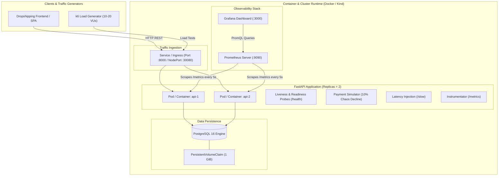
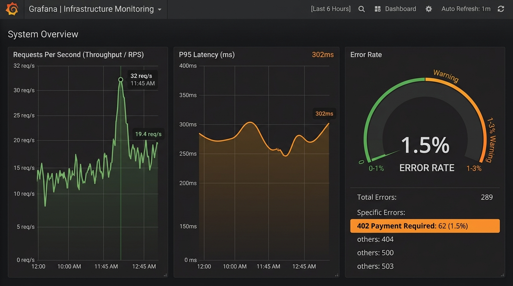

# 🛒 Dropshipping Store — Resilient Cloud-Native Backend API

[](https://fastapi.tiangolo.com)
[](https://www.python.org)
[](https://www.postgresql.org)
[](https://www.docker.com)
[](https://kubernetes.io)
[](https://k3s.io)
[](https://prometheus.io)
[](https://grafana.com)
[](https://k6.io)
[](https://opensource.org/licenses/MIT)

A production-grade, cloud-native backend built for an e-commerce dropshipping platform. Engineered with **FastAPI**, **PostgreSQL**, **Docker Compose**, and **Kubernetes**, featuring end-to-end observability (**Prometheus & Grafana**), automated **k6 load testing**, chaos engineering (**simulated payment failures**), and **self-healing** container orchestration.

---

## 🏛️ System Architecture



---

## 🌟 Key Engineering Features

- **⚡ High-Performance Asynchronous API:** Built with FastAPI, Pydantic v2 validation, and SQLAlchemy ORM on top of PostgreSQL 16.
- **🎲 Chaos Engineering & Failure Injection:** Simulated payment processor with a controlled **10% random failure rate** (HTTP `402 Payment Required` with detailed reason codes) for testing system resiliency and client error-handling.
- **⏱️ Artificial Latency Simulation (`/slow`):** Endpoint accepting customizable async delay query params (`?delay=0.5`) to benchmark p95/p99 latency thresholds under stress.
- **📊 Production Observability (RED Method):**
  - Native Prometheus instrumentation exposing Rate, Errors, and Duration metrics.
  - Zero-touch **Grafana auto-provisioning** with pre-configured datasources and dashboards.
- **☸️ Kubernetes Cloud-Native Deployment (`k8s/`):**
  - Declarative manifests: `ConfigMap`, `Secret`, `PersistentVolumeClaim`, `Deployment`, and `Service`.
  - Configured **Liveness** and **Readiness** health probes pointing to `/health`.
  - **Self-Healing validation:** Verified automatic pod recreation by ReplicaSet with zero downtime.
- **🚀 Automated Stress & Load Testing (`k6/`):** k6 scenarios simulating real e-commerce traffic (browsing catalog, placing orders, and injecting latency) scaled across 10 to 20 concurrent Virtual Users (VUs).

---

## 📈 Live Observability Showcase (Grafana)

The stack automatically monitors backend vitals using the **RED method** (Rate, Errors, Duration):



### Dashboard Panels Explained:
1. **📈 Requests Per Second (Throughput / RPS):** Real-time request volume categorized by HTTP status code and endpoint path (`/products`, `/orders`, `/slow`, `/health`). Captured peaking at **~32 req/s** during k6 load testing.
2. **⏱️ P95 Latency (Seconds / Milliseconds):** Tracks response time for the 95th percentile of incoming traffic, revealing latency distribution and artificial spikes triggered by `/slow`.
3. **🚨 Error Rate (%):** Visualizes the percentage of client (4xx) and server (5xx) errors. Accurately flags simulated payment declines (HTTP 402) during load spikes.

---

## 📁 Project Structure

```text
dropship-backend/
├── app/                              # Core Application Code
│   ├── database.py                   # SQLAlchemy connection & session pooling
│   ├── models.py                     # Database models (Product, Order, OrderItem)
│   ├── schemas.py                    # Pydantic v2 request/response schemas
│   ├── seed.py                       # Initial sample catalog data
│   ├── payment.py                    # Payment gateway simulator (10% chaos failure)
│   └── main.py                       # FastAPI routes, CORS, and Prometheus exporter
├── docker/                           # Container Infrastructure
│   ├── Dockerfile                    # Optimized Python 3.11-slim container image
│   ├── docker-compose.yml            # Multi-service stack (API, DB, Prometheus, Grafana)
│   ├── .env.example                  # Environment configuration template
│   ├── prometheus/
│   │   └── prometheus.yml            # Scrape jobs and targets configuration
│   └── grafana/
│       ├── dashboards/               # Pre-built dashboard JSON definitions
│       └── provisioning/             # Automated datasource & dashboard configs
├── k8s/                              # Kubernetes Manifests
│   ├── kind-config.yaml              # Local Kind cluster configuration with NodePort mapping
│   ├── configmap.yaml                # Non-sensitive environment configuration
│   ├── secret.yaml                   # Secure database credentials
│   ├── postgres-pvc.yaml             # 1 GiB PersistentVolumeClaim
│   ├── postgres-deployment.yaml      # PostgreSQL Deployment & ClusterIP Service
│   └── api-deployment.yaml           # FastAPI Deployment (2 replicas), Probes & NodePort Service
├── k6/                               # Performance & Load Testing
│   ├── load_test.js                  # k6 scenario (10-20 VUs: catalog, orders, latency)
│   └── run-load-test.ps1             # PowerShell runner script using Docker
├── docs/assets/                      # Documentation assets & screenshots
│   └── grafana-dashboard.png         # Screenshot of the live Grafana dashboard
├── requirements.txt                  # Python dependencies
└── README.md                         # Documentation
```

---

## 🚀 Quick Start Guide

### Option 1: Run with Docker Compose (Recommended)

Spins up the entire microservices stack (API, Database, Prometheus, and Grafana) with one command:

```bash
# 1. Navigate to the docker directory
cd docker

# 2. Launch the services in detached mode
docker compose up -d

# 3. Verify service health
docker compose ps
```

#### Service URLs:
- **API Root & Health:** [http://localhost:8000/health](http://localhost:8000/health)
- **Interactive OpenAPI Documentation (Swagger UI):** [http://localhost:8000/docs](http://localhost:8000/docs)
- **Prometheus UI:** [http://localhost:9090](http://localhost:9090)
- **Grafana Dashboard:** [http://localhost:3000](http://localhost:3000) *(User: `admin` | Pass: `admin`)*

---

### Option 2: Deploy to Local Kubernetes (K3s / Kind)

The manifests in [`k8s/`](file:///C:/Users/luisa/Downloads/Dropshipping/dropship-backend/k8s) are 100% portable and validated on both **lightweight K3s (`k3d`)** and **standard Kubernetes (`kind`)**:

#### 2A. Using Lightweight K3s (`k3d`) — Recommended (Uses ~60% less RAM)
```bash
# 1. Create the K3s cluster with NodePort port mapping (disabling Traefik to save memory)
k3d cluster create dropship-k3s -p "30080:30080@server:0" --k3s-arg "--disable=traefik@server:0"

# 2. Build and import the local API image into the K3s cluster
docker build -t dropship-api:latest -f docker/Dockerfile .
k3d image import dropship-api:latest -c dropship-k3s

# 3. Apply Kubernetes manifests
kubectl apply -f k8s/configmap.yaml -f k8s/secret.yaml -f k8s/postgres-pvc.yaml -f k8s/postgres-deployment.yaml -f k8s/api-deployment.yaml

# 4. Check status
kubectl get pods -o wide
```

#### 2B. Using Standard Kubernetes (`kind`)
```bash
# 1. Create Kind cluster with port mapping
kind create cluster --name dropship-cluster --config k8s/kind-config.yaml

# 2. Load image and apply manifests
kind load docker-image dropship-api:latest --name dropship-cluster
kubectl apply -f k8s/configmap.yaml -f k8s/secret.yaml -f k8s/postgres-pvc.yaml -f k8s/postgres-deployment.yaml -f k8s/api-deployment.yaml
```

Access the API running inside Kubernetes via NodePort at **`http://localhost:30080/health`**.

---

### Option 3: Local Python Virtual Environment

```bash
# 1. Create and activate a virtual environment
python -m venv .venv
source .venv/Scripts/activate     # On Windows (PowerShell: .\.venv\Scripts\Activate.ps1)

# 2. Install dependencies
pip install -r requirements.txt

# 3. Start development server
uvicorn app.main:app --reload --host 0.0.0.0 --port 8000
```

---

## ⚡ Running the Load Test with k6

Simulate real-world traffic with 10 to 20 concurrent Virtual Users over a 40-second benchmark:

### Using Docker (Zero local installations needed):
```bash
# Run the automated PowerShell script:
.\k6\run-load-test.ps1

# Or run directly via Docker CLI:
docker run --rm -i \
  --network docker_default \
  -e TARGET_URL="http://api:8000" \
  -v "${PWD}/k6:/k6" \
  grafana/k6 run /k6/load_test.js
```

### Benchmark Summary Results:
```text
✓ products status 200
✓ order handled (201 or 402)
✓ health status 200
✓ slow status 200

http_req_duration..............: avg=44.25ms  min=1.72ms  med=4.28ms  max=1.14s  p(95)=301.73ms
http_req_failed................: 1.53% (20 out of 1299 failed due to chaos payment declines)
http_reqs......................: 1299 requests (32.31 req/s)
vus............................: 20 concurrent Virtual Users
```

---

## 🛡️ Kubernetes Self-Healing Verification

To observe Kubernetes automatically restoring desired state when a pod crashes:

1. **List the active API pods:**
   ```bash
   kubectl get pods -l app=dropship-api
   ```
2. **Delete one pod to simulate a node crash or fatal error:**
   ```bash
   kubectl delete pod <pod-name>
   ```
3. **Inspect the immediate recovery:**
   ```bash
   kubectl get pods -l app=dropship-api
   ```
   *Within 2 seconds, the ReplicaSet identifies the discrepancy (1 running vs 2 desired) and provisions a new replacement pod. HTTP traffic on `http://localhost:30080/health` continues uninterrupted.*

---

## 📑 API Reference

| Method | Endpoint | Description | Response Status |
|:---|:---|:---|:---:|
| `GET` | `/` | Welcome message & links | `200 OK` |
| `GET` | `/health` | Service health & PostgreSQL connectivity | `200 OK` |
| `GET` | `/products` | Catalog listing (supports `?category=` filter) | `200 OK` |
| `GET` | `/products/{id}` | Detailed product information | `200 OK` / `404 Not Found` |
| `POST` | `/products` | Create a new catalog item | `201 Created` |
| `POST` | `/orders` | Submit order with simulated payment gateway (10% chaos rate) | `201 Created` / `402 Payment Required` |
| `GET` | `/orders` | Audit log of all completed & failed orders | `200 OK` |
| `GET` | `/orders/track/{number}` | Track specific order by code (`MSC-...`) | `200 OK` / `404 Not Found` |
| `GET` | `/slow` | Artificial async delay injection (`?delay=X` seconds) | `200 OK` |
| `GET` | `/metrics` | Prometheus RED metrics exposition format | `200 OK` |
| `GET` | `/docs` | Interactive Swagger UI API playground | `200 OK` |

---

## 📄 License

This project is open-source and licensed under the [MIT License](LICENSE).
